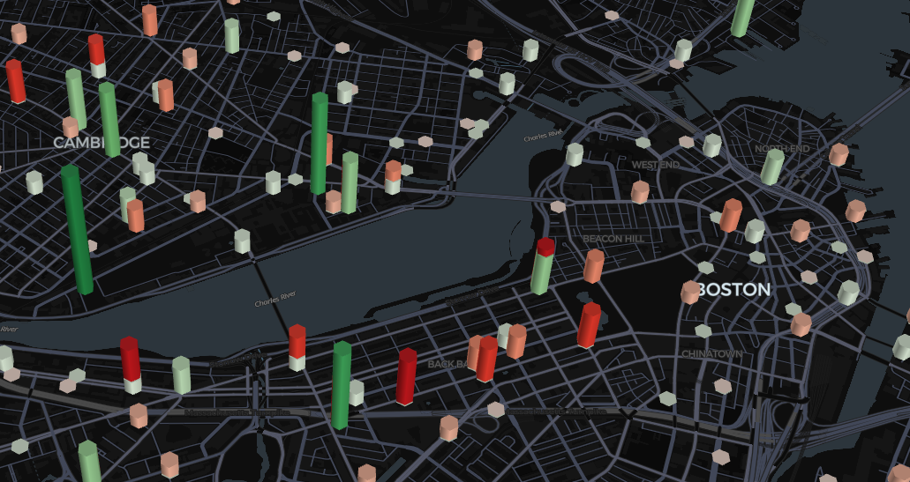

# bluebikes-busiest-day-2024
Visualizing the Busiest Day of 2024 for Blue Bikes in Boston using Python, Pandas, Panel, DeckGL, scikit-learn, & UV




## Data Source
All data for this can be found on the Bluebikes website at https://bluebikes.com/system-data

## 🚴‍♂️ Finding the Busiest Day

First, I merged all of the CSVs into a single dataframe. This came out to **4,751,790 records**.

Next, I processed the data by:
- Removing columns we didn’t need
- Filtering out outliers (rides under 2 minutes or over 24 hours)

That brought us down to a clean **4,668,653 records**!

### Top 10 Busiest Days

| Date       | Total Rides |
|------------|--------------|
| 2024-09-17 | 22,233       |
| 2024-09-27 | 22,024       |
| 2024-09-13 | 21,953       |
| 2024-09-12 | 21,681       |
| 2024-09-18 | 21,583       |
| 2024-09-10 | 21,556       |
| 2024-09-14 | 21,475       |
| 2024-09-11 | 21,345       |
| 2024-10-04 | 21,109       |
| 2024-09-04 | 21,043       |

That’s a pretty tight Top 10! but **September 17th**, A random fall Tuesday with sunny skies, low humidity, and a high of 82°F made for perfect biking weather in Boston.

And if you're curious... the **Slowest Day:** was January 7th Boston's first winter storm of 2024 still saw **641 riders** out there! ❄️

## Preping the filtered and Clearned Data for Visualization

With the data cleaned, a more calculations were needed to easily visualize the start and end of trips.

- Each ride was split into two event records, one start event & one end event. This turned 22,233 rides into 44,400 events. Some rides were filted for ending the next day, or never ending!

- I grouped the 2,165 unique latitudes & longitudes using DBSCAN. Locations within 30 meters were clustered, reducing unique points to 635 (a 70.7% drop). This boosts performance of the dashboard and cleans up the visual.

- Last, I grouped every event into 144 10-minute window across the day. We used these windows to animate the bike events over time.

Here’s the final data schema:

```
- event_id: Unique identifier for each event  
- ride_id: Original ride identifier  
- event_time: Timestamp of the event  
- event_type: "start" or "end"  
- lat, lng: Original coordinates  
- bike_type: "classic_bike" or "electric_bike"  
- minute: Minute of day (0-1439)  
- time_window: 10-minute interval (0-143)  
- group_lat, group_lng: Grouped coordinates for performance  
- coordinate_group_id: Cluster ID for coordinate grouping  
```
## Creating the visualization

This part of the project was inspired by learning Panel and checking out the NYC DeckGL example:
https://panel.holoviz.org/gallery/nyc_deckgl.html

I used DeckGL to create a time-animated hexagonal heatmap. The visualization shows:

- **Green hexagons**: Bike pickup locations (trip starts)
- **Red hexagons**: Bike drop-off locations (trip ends)
- **Hexagon height**: Represents event density in 24 hours
- **Hexagon color intestisity:** Represents activity density in that interval
- **Time slider**: Navigate through 10-minute intervals across the day
- **Animation controls**: Play/pause and speed controls for automatic time progression

The hexagonal binning aggregates nearby events into visual clusters, making patterns easier to see while maintaining good performance even with 44,000+ events.

## Project Structure

```
bluebikes-busiest-day-2024/
├── data/
│   ├── raw/                    # Original CSV Blue Bike files
│   ├── clean/                  # Cleaned ride data (busiest day only)
│   └── processed/              # Events data for visualization
├── src/
│   └── data_loader.py          # Data utilities for visualization
|   └── data_processor.py       # Event data processing
|   └── data_wrangler.py        # Initial data cleaning & agregation
├── dashboard.py                # Interactive Panel dashboard
├── pyproject.toml              # Project dependencies
└── README.md                   # What your reading right now
```

## Running the Project

1. **Clone the repository & set up the environment**
   ```bash
   uv sync
   ```

2. **Download the data**
   - Visit https://bluebikes.com/system-data
   - Download all 2024 monthly CSV files
   - Place them in the `data/raw/` directory

3. **Process the data**
   ```bash
   # Find busiest day and create parquet dataset
   uv run python src/data_wrangler.py
   
   # Process parquet data into events for visualization
   uv run python src/data_processor.py
   ```

4. **Launch the dashboard**
   ```bash
   uv run panel serve dashboard.py --show
   ```